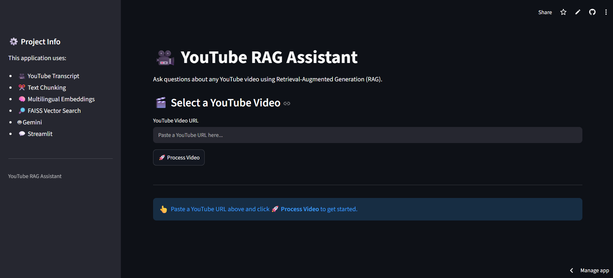
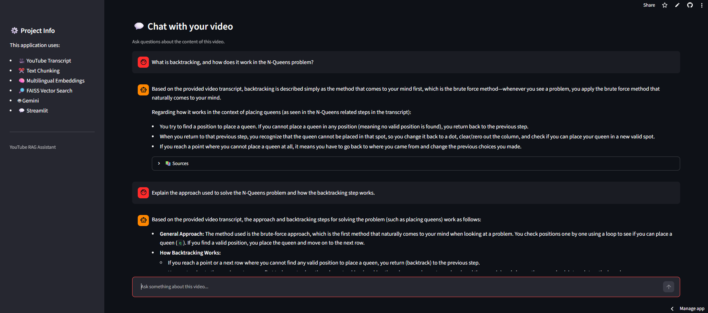

# 🎥 YouTube AI Chatbot

An AI-powered chatbot that lets users ask questions about YouTube videos using **Retrieval-Augmented Generation (RAG)**.

The application extracts the video's transcript, splits it into chunks, generates multilingual embeddings, retrieves relevant information using FAISS, and uses Google Gemini to generate grounded answers.

---

## 🚀 Live Demo

👉 [Try the YouTube AI Chatbot](https://youtube-chatbot-esuureiudiu7buf5yrbgvx.streamlit.app/)

---

## ✨ Features

- 🎥 Process YouTube videos with available transcripts
- 📝 Automatic transcript extraction
- ✂️ Transcript chunking
- 🧠 Multilingual embeddings using Hugging Face
- 🔎 Semantic search using FAISS
- 🤖 Answer generation using Google Gemini
- 💬 Multiple questions about the same video
- 🧠 Conversation context during the session
- ⏱️ Source timestamps for retrieved information
- ▶️ Watch the processed video inside the app
- 🌐 Interactive Streamlit interface

---

## 🛠️ Tech Stack

- **Python**
- **Streamlit**
- **LangChain**
- **Google Gemini**
- **Hugging Face**
- **FAISS**
- **YouTube Transcript API**

---

## 🧠 How It Works

```text
YouTube URL
     ↓
YouTube Transcript
     ↓
Text Chunking
     ↓
Multilingual Embeddings
     ↓
FAISS Vector Store
     ↓
User Question
     ↓
Similarity Search
     ↓
Relevant Chunks
     ↓
Google Gemini
     ↓
Answer + Sources
```

---

## 📸 Screenshots

### 🏠 Application Interface



### 💬 Chat with Video



---

## 📂 Project Structure

```text
YouTube-RAG/
├── screenshots/
│   ├── home.png
│   └── chats.png
├── src/
│   ├── embeddings.py
│   ├── llm.py
│   ├── pipeline.py
│   ├── rag.py
│   ├── retriever.py
│   ├── transcript.py
│   ├── vectorstore.py
│   └── youtube.py
├── app.py
├── requirements.txt
└── README.md
```

---

## ⚙️ Run Locally

```bash
git clone https://github.com/utkarsh8819-bit/youtube-chatbot.git
cd youtube-chatbot
pip install -r requirements.txt
streamlit run app.py
```

Create a `.env` file and add:

```env
GEMINI_API_KEY=your_api_key_here
```

> ⚠️ Never commit your API key or `.env` file to GitHub.

---

## ☁️ Deployment

Deployed using **Streamlit Community Cloud** and connected to the GitHub repository.

---

## 👨‍💻 Author

**Utkarsh Soni**

⭐ If you find this project useful, consider starring the repository.